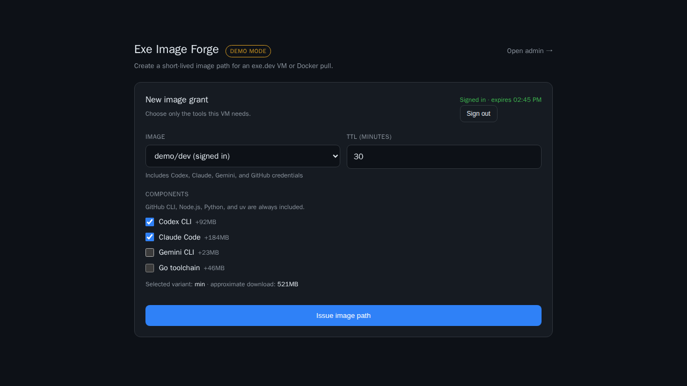
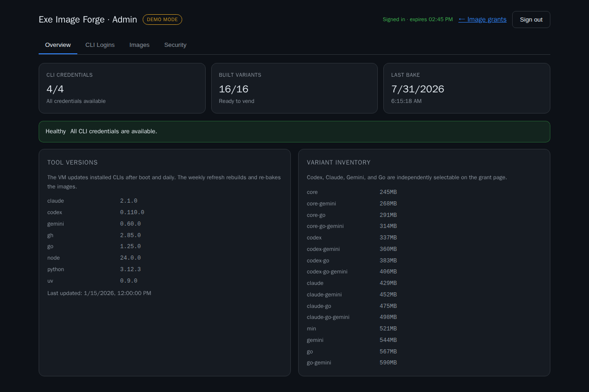

# Web UI guide

This guide keeps the image-grant page and admin console visually and
behaviorally consistent as contributors and AI agents extend them.

## Reference screens

### Image grants



### Administration overview



The screenshots come from the deterministic, loopback-only demo server. The
`Demo mode` badge makes them distinguishable from a production installation.

Regenerate both images after an intentional visual change:

```bash
make screenshots
```

Inspect the resulting diff instead of accepting regenerated images blindly.

## Product structure

The two pages share one authentication session but serve different tasks:

| Page | Primary job |
| --- | --- |
| `/` | Choose a repository, TTL, and tool variant; issue an image path |
| `/admin/` | Inspect logins and variants, authenticate CLIs, bake images, manage passkeys |

The admin console has four stable sections:

- **Overview** — health, tool versions, variants, and latest bake
- **CLI Logins** — credential state and authentication terminal
- **Images** — bake workflow and generated agent context
- **Security** — passkey registration and removal

Prefer adding content to the existing section that owns it. Add a new top-level
tab only when the task cannot fit one of these responsibilities.

## Visual language

Both pages define the same core tokens:

| Token | Meaning |
| --- | --- |
| `--bg` | Page and recessed input background |
| `--fg` | Primary text |
| `--mut` | Secondary text and labels |
| `--card` | Raised panel background |
| `--line` | Borders and dividers |
| `--acc` | Primary action and link color |
| `--ok` | Healthy or signed-in state |
| `--warn` | Degraded state and demo indicator |
| `--bad` | Errors and destructive actions |

Design principles:

- compact operational UI rather than a marketing dashboard
- one obvious primary action per card
- short labels with details in muted supporting text
- bordered cards, eight-to-twelve-pixel corner radii, and restrained shadows
- tabular or monospace text for paths, versions, commands, and logs
- color plus text or shape; never communicate status by color alone

Reuse existing classes and tokens before adding a new component style.

## Responsive behavior

- The grant page stays readable in one column at phone widths.
- Admin metrics and two-column grids collapse below 760 pixels.
- Tabs remain horizontally scrollable instead of wrapping into ambiguous rows.
- Tables keep an overflow wrapper.
- The terminal remains usable at a reduced height on narrow screens.
- Primary controls need touch-friendly hit targets and must not depend on hover.

The Playwright suite exercises both desktop Chromium and a Pixel 7 viewport.

## Authentication and state

Authentication is part of the visual contract:

- Before sign-in, protected controls are hidden, not merely disabled.
- Session expiry or sign-out returns both pages to their sign-in gate without a
  reload.
- Login/logout changes propagate across tabs through `BroadcastChannel`.
- A protected API `401` triggers session revalidation.
- The UI displays the session expiry time while authenticated.
- Demo fixtures must always show a visible `Demo mode` badge.

Do not render account names, credential paths, grant controls, terminal state,
or passkey management before authentication.

## Interaction and copy

- All visible copy is English.
- Button labels describe the action: `Issue image path`, `Bake now`, `Sign out`.
- Loading labels use an ellipsis and disable the initiating control.
- Errors state what failed and, where possible, what the operator can do next.
- Destructive or credential-invalidating actions require confirmation.
- Generated commands use `<pre>` blocks and an adjacent copy button.
- Long-running bake output is bounded and remains scrollable.

Escape any value returned by an API before assigning it to `innerHTML`. Prefer
`textContent` when markup is unnecessary.

## Accessibility

- Inputs have visible `<label>` elements.
- Tabs keep `role="tab"`, `role="tablist"`, and `aria-selected`.
- Keyboard focus must remain visible.
- Enter submits password and short text workflows where expected.
- Headings preserve a meaningful hierarchy.
- Status messages include readable text and sufficient contrast.
- New controls must be reachable and operable with a keyboard.

## Asset and CSP policy

The pages are embedded by `vend/ui.go`; there is no frontend compilation step.
Pinned browser dependencies live in `vend/assets/` with their licenses.

- Do not load scripts, styles, fonts, or terminal code from a CDN.
- Keep inline application scripts compatible with the CSP hash generation in
  `vend/main.go`.
- Keep `connect-src` same-origin unless a reviewed feature requires otherwise.
- Update security-header tests when adding a new browser capability.

## Review checklist

For a user-visible web change:

1. Exercise the change with `make dev`.
2. Run `make check` and `make e2e`.
3. Test both unauthenticated and authenticated states.
4. Check desktop and narrow layouts.
5. Confirm protected data is not present before sign-in.
6. Regenerate screenshots only for intentional visual changes.
7. Rebuild the installed service with `exe-image-forge vend-build` when the
   live VM must reflect the source change.
